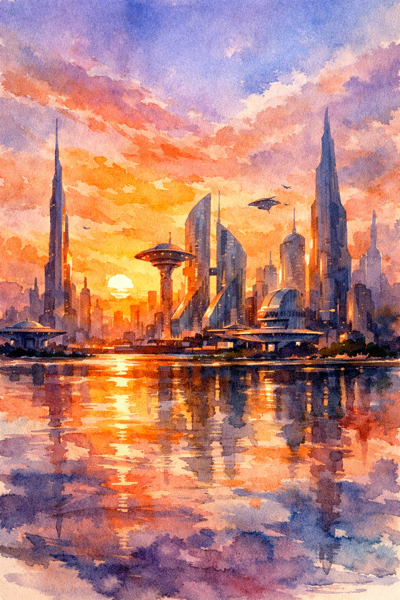
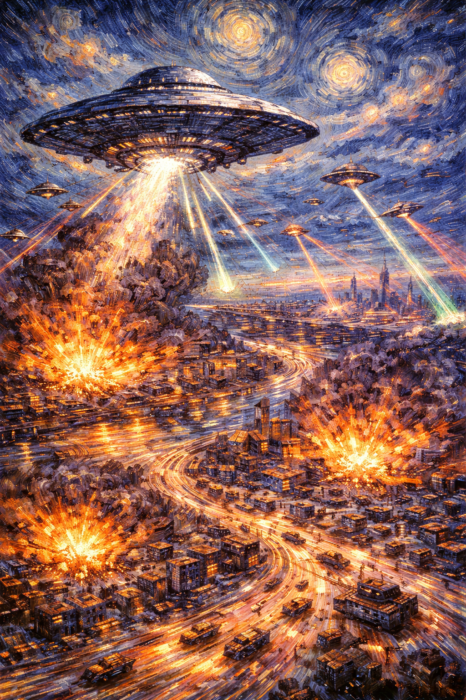

# Objective: Create prompts for models that generate images.

**Prompt 1:**
```
A futuristic city skyline at sunset in watercolor style.
```

**Response 1:**


**Prompt 2:**
```
Aliens invading earth from a bird's eye view in Van Gogh style with long exposure.
```

**Response 2:**


**Comparison:**

With the vague prompt (prompt 1), the model decided what to show, however, with the descriptive prompt (prompt 2), the model provided an image containing much more detail based on what was requested in the prompt which made the output much more specific.